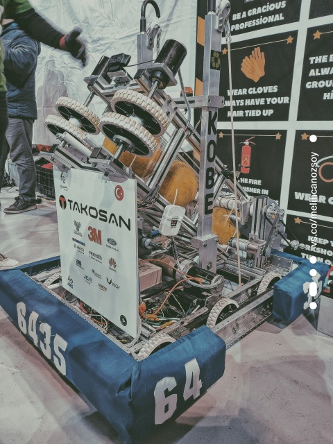
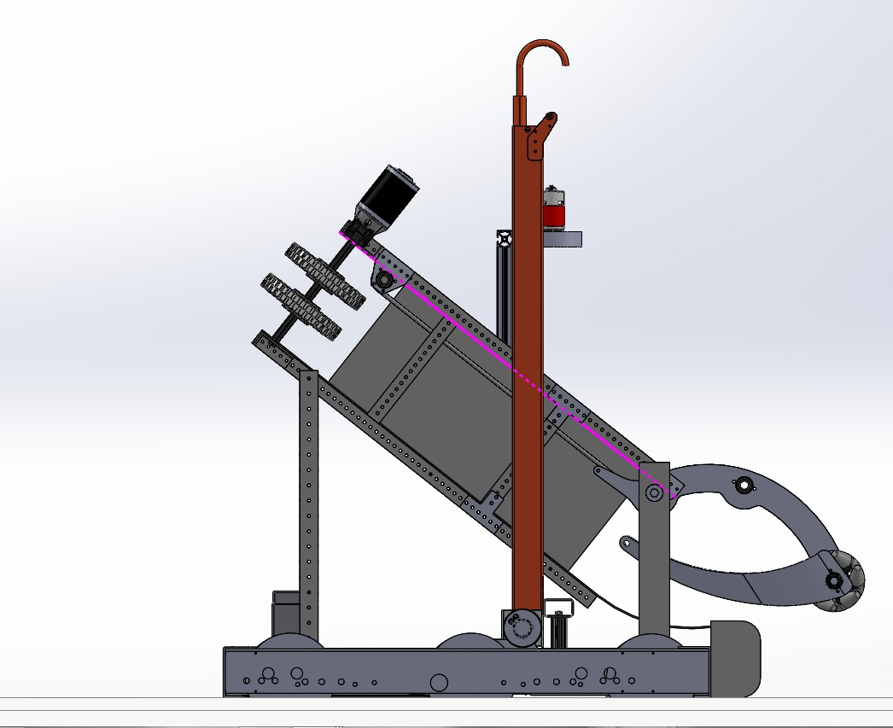
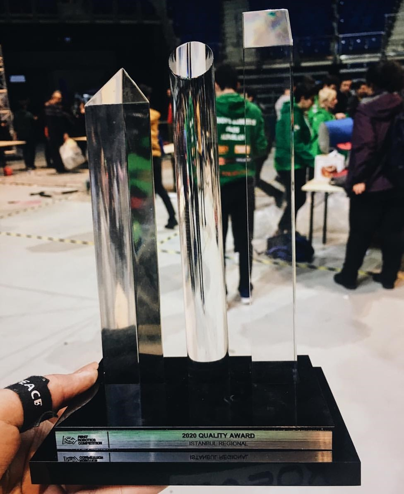

  
  
  

I designed the robots used in the 2019 and 2020 seasons in the Jetsons Robotics 6435 team, competing in the FRC, the world's most prestigious competition, in the Solidworks program, and implemented it with my team. I was a leader in the design, construction and electronics departments of the robot. I also co-piloted these robots. The robot used in the 2020 season won the "Quality Award" given to the best quality and durable robot in the competition. In this team where I have been a student for 2 seasons, I am currently the mentor of the Mechanics department.
